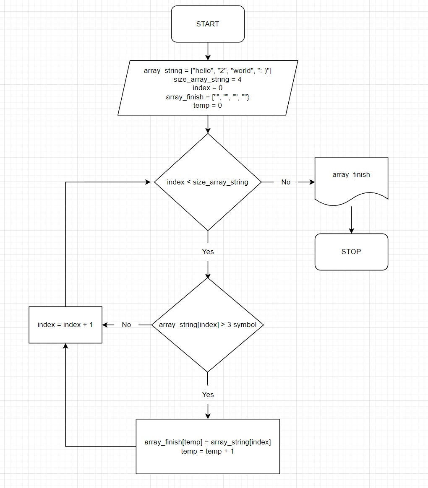

# Итоговая проверочная работа

## Алгоритм работы
В начале инициализируются массивы строк:
* **"arrayString"**  
* **"arrayFinish"**

*Массив "arrayString" содержит заполненные строки, а "arrayFinish" является пустым и предназначен для результата.*
Затем вызывается функция ["*FillterOfArray*"](#функция-fillterofarray), а после неё функция ["*PrintArray*"](#функция-printarray).

## Функция **"FillterOfArray"** 
*Предназначена для заполнения массива. Она принимает два массива строк как параметры. Внутри используется цикл for для итерации по первому массиву. Если длина строки меньше или равна 3 символам, то она добавляется во второй массив. Так же используется переменная temp для отслеживания текущей позиции во втором массиве, куда добавляются строки.*

## Функция **"PrintArray"**
*Предназначена для вывода результата на консоль. Она принимает массив строк как параметр и использует цикл for для итерации по нему, выводя каждый элемент на консоль.*

## Блок-схема алгоритма
